# watchyourhealth

Technical Assessment for Watch Your Health - Flutter Project

-----------------------------------------------------------------

## Features Implemented

- Firebase Email/Password Authentication
- Firestore integration with pagination and offline support
- Assessment & Appointment modules
- Favorites stored locally
- Custom animation and Hero transitions
- Responsive UI for phones & tablets
- Riverpod-based state management
- Clean Architecture structure

---

## Architecture

This app follows Clean Architecture principles:

lib/
├── core/ # Common utils, themes, services
├── features/ # Feature-specific modules
│ ├── auth/ # Authentication logic
│ ├── assessment/ # Assessment list & detail
│ ├── appointment/ # Appointments
├── shared/ # Shared widgets, models
├── main.dart

**Layers:**

- `Data`: Firebase sources, DTOs, SharedPreferences
- `Domain`: Models, Repositories (abstract)
- `Presentation`: UI widgets, Riverpod state, Screens

---

## State Management

- **Riverpod** (v2+) for state management and dependency injection.
- All business logic separated from UI.

---

## 📲 How to Run

1. Clone the repo:
   by using thie - git clone https://github.com/Magesh-kanna/watchyourhealthcd
2. cd watchyourhealth
3. flutter pub get
4. Set up Firebase:
   Download google-services.json & GoogleService-Info.plist
   Place them in android/app/ and ios/Runner/ respectively.
5. "flutter run" or "fvm flutter run" [If you are using FVM]

## Design

**Figma
** : https://www.figma.com/design/PI0W5LodE1yWi5GY0ZCP1p/Flutter-task?node-id=0-1&p=f&t=Ig9gBzZRRkMQAG4b-0
UI fully matches Figma: spacing, typography, colors, responsiveness.

## 📸 Screenshots

### Login Screen

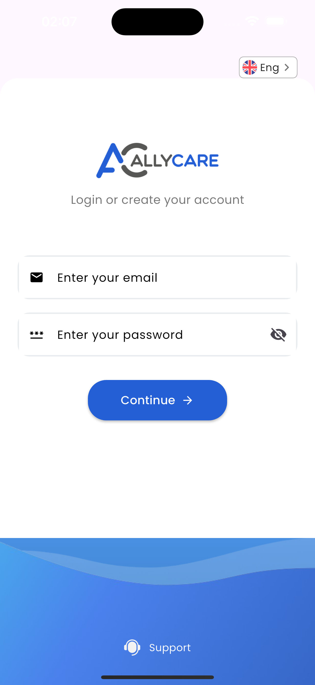

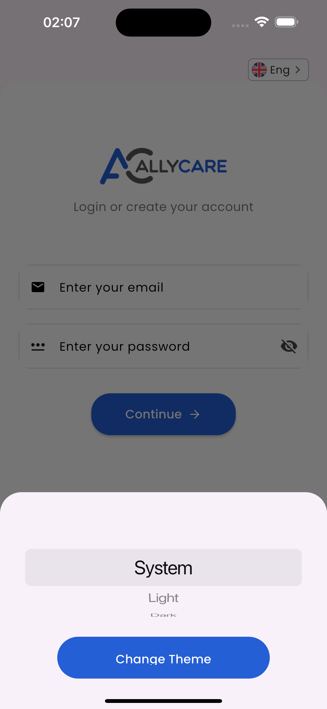
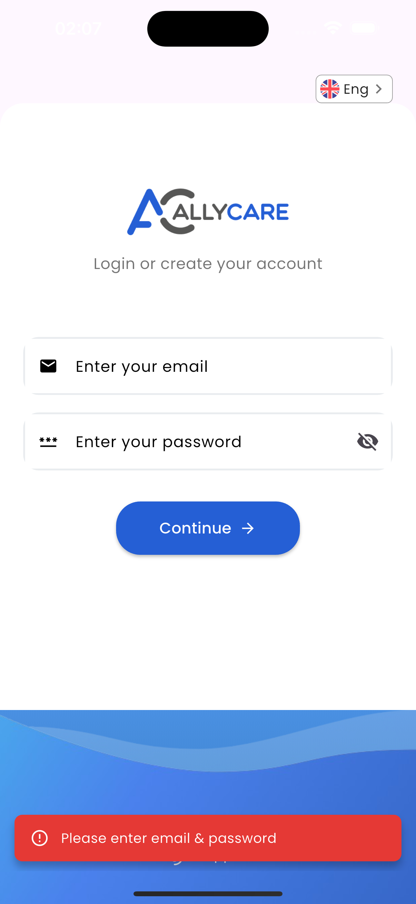
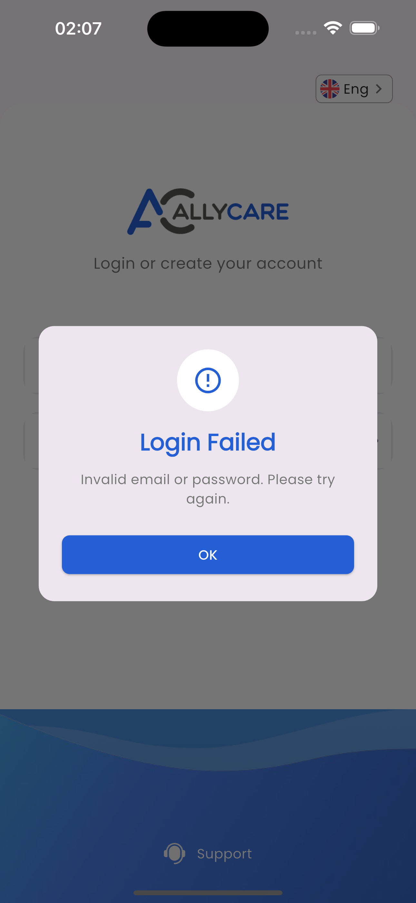

### Home Screen & Assessment Tab

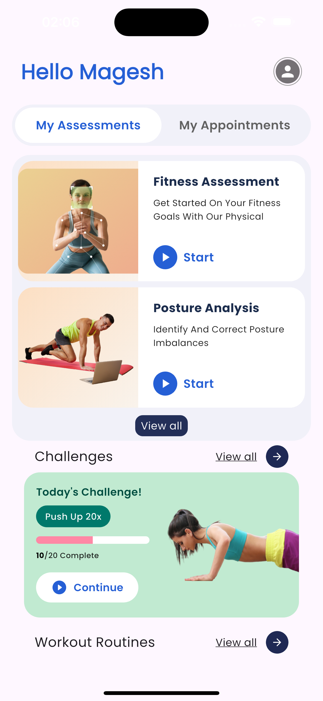
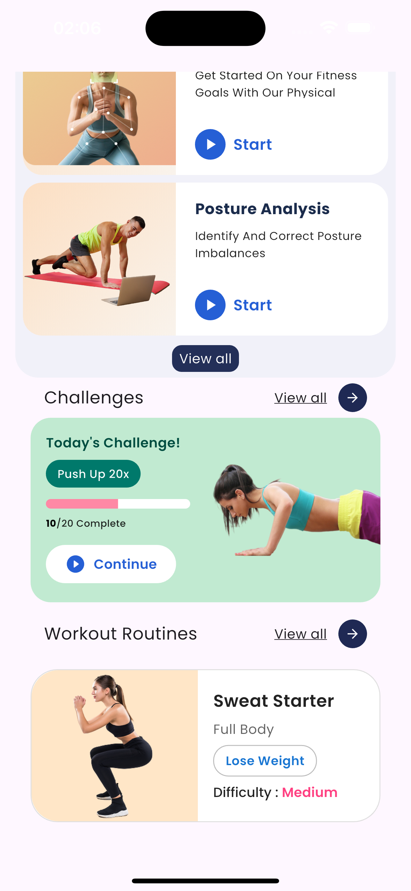

### Appointment Tab

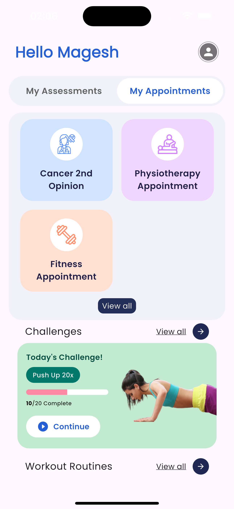
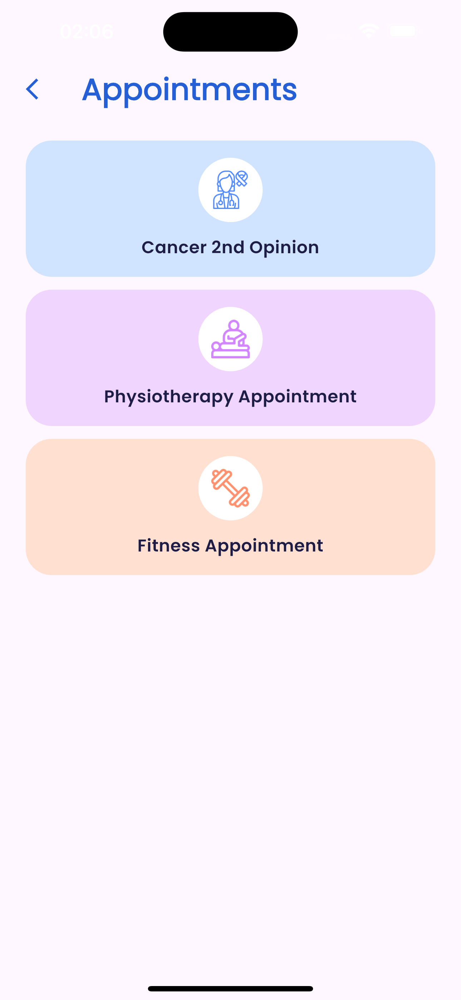

### Assessment Module

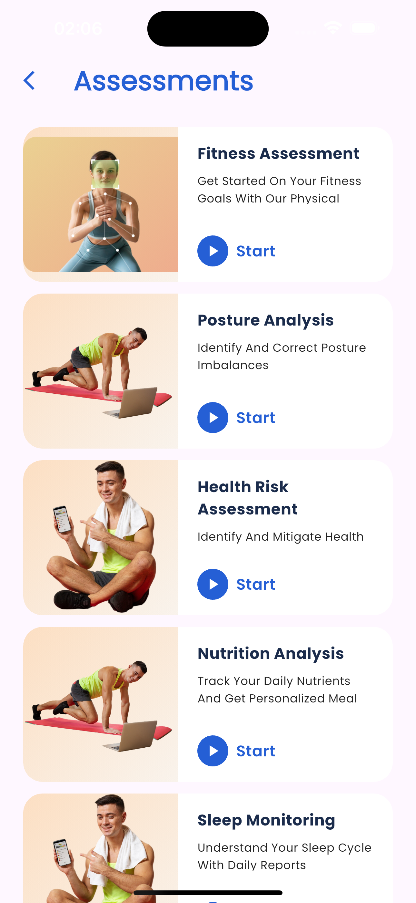
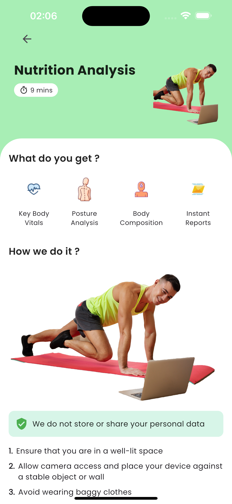

### Profile Screen

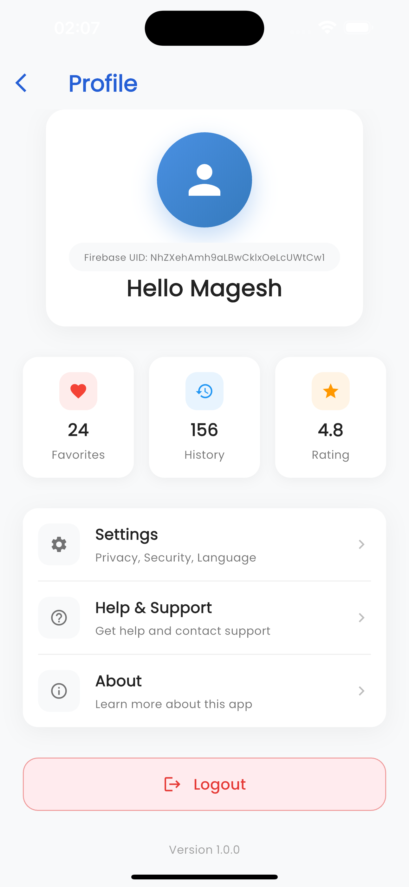

### Logout dialog

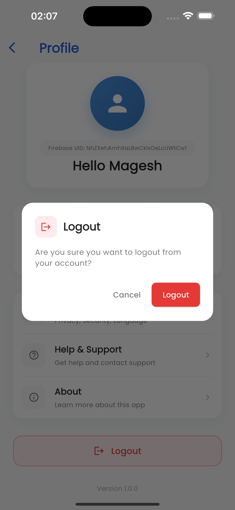

## Technical Decisions

1. Chose Riverpod for better modularity, testing, and DI.
2. Implemented Clean Architecture to separate concerns and improve testability.
3. Used Firestore’s cache mechanism with cacheSizeBytes.
4. Used flutter_hooks to simplify widget state where applicable.
5. Animations powered by Hero, AnimatedSwitcher, and PageRouteBuilder.

## Challenges

1. Handling Firestore pagination with offline caching.
